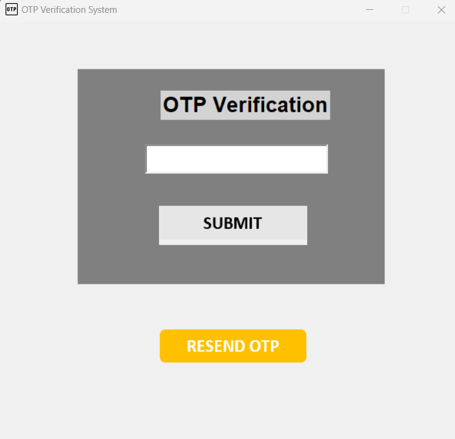

# One-Time Password (OTP) Verification System
## Introduction
Starting from scratch while developing a verification system might be challenging. Nonetheless, relax! We can help you with that.


Using the Python programming language, we created an OTP verification system that is trustworthy and secure. You can quickly add OTP verification capability to your website or application by utilizing the Twilio API to deliver OTP messages and the Tkinter toolkit to make a simple user interface.


Using a secure verification system is crucial to guaranteeing that only permitted people have access to your goods. Our OTP verification method comes into play in this situation. Users don't need to keep track of their usernames or passwords. They can just input the OTP code that was supplied to their phone number as an alternative.


So *What is OTP*? For the only purpose of authentication, a temporary code is produced and delivered to the user's phone. Like a bouncer at a club, it assists in making sure that only authorized users have access to your goods. You may improve the usability and security of your product by utilizing our project.

## Libraries

Our project uses some pretty cool libraries to make the magic happen. 

- **[Twilio](https://www.twilio.com/docs/libraries/python)** -  a library for Python that lets devices and services communicate through the Twilio API. It is used in our project to send OTP messages to the user's phone number.
- **[Random](https://docs.python.org/3/library/random.html)** - a standard library in Python used to generate random numbers. It is used in our project to generate a random 5-digit OTP.
- **[Tkinter](https://docs.python.org/3/library/tkinter.html)** - a built-in Python library used to create graphical user interfaces (GUIs). It is used in our project to create a simple frontend interface for the OTP verification system.

## Twilio API
In this application, a One-Time Password (OTP) is sent to the confirmed phone number of the receiver using the Twilio service, which generates a random 5-digit number. A notification that reads "Login Success!" is shown if the receiver enters the proper OTP in the GUI entry area. The notice "Incorrect OTP!" is displayed, unfortunately, if the inputted OTP is inaccurate.

Since it offers end-to-end encryption, strong security features, and complies with industry standards like GDPR and HIPAA, Twilio is a trustworthy and safe API to utilize for OTP verification. For the purpose of preventing illegal access and safeguarding user data, it also provides features like rate limitation, phone number verification, and fraud detection.

#### *Sign up for Twilio*
To use the Twilio API, you need to create a Twilio account. You can do this by visiting the [Twilio website](https://www.twilio.com/try-twilio) and clicking on the **Start your free trial** button. You will be redirected to the Twilio Console, where you can create a new account.

## Significant Variables 
To make our program work, we have some important variables that store necessary information. These are:

- `TWILIO_SID`: This variable stores the Twilio Account SID, which is used to authenticate with the Twilio API.

- `TWILIO_AUTH_TOKEN`: This variable stores the Twilio authentication token, which is also used to authenticate with the Twilio API.

- `SENDER_NUMBER`: This variable stores the Twilio phone number used to send messages to the recipient.

- `RECIPIENT_NUMBER`: This variable stores the phone number of the recipient who will receive the OTP.

### How can You change these variables?
Open the `main.py` file which you can find in the `src` folder. Then, change the values of the variables to your own values.
```py
# define essential variables
## insert Twilio SID 
TWILIO_SID = ''   # DELETE BEFORE PULL REQUEST!!!!!
## insert Twilio Auth Token
TWILIO_AUTH_TOKEN = ''   #DELETE BEFORE PULL REQUEST!!!!!
## insert sender number aka twilio number
SENDER_NUMBER = '+123456789'   #DELETE BEFORE PULL REQUEST!!!!!
## insert recipient number aka verified recipient number in twilio
RECIPIENT_NUMBER = '+88888888'   #DELETE BEFORE PULL REQUEST!!!!!
```
Do not touch anything else, Just paste your own values in the variables.
Which you can find in your Twilio account.
Also, make sure to keep the quotes `''` around the values.

## Class

The `otp_verifier` class is a subclass of the `Tk` class which is used to create a Graphical User Interface (GUI) window.
The `otp_verifier` class has the following methods:

#### `__init__(self)`: 
Init stands for initialize. This method is called when an object of the `otp_verifier` class is created.
Here twilow client is initialized and the window is created.
If you give wrong or invalid details in the Variables mentioned above, Twilio will not Initialize and the program will not run. 


#### `Labels(self)`:
`Labels` handles all the text creation in the GUI. 

#### `Entry(self)`:
This method creates a `Text` widget where the sender,can enter the OTP received on the recipient's phone number.

#### `Buttons(self)`:
This method creates two `Button` widgets, one for submitting the entered OTP and the other for resending the OTP to the recipient's phone number.

#### `checkOTP(self)`:
This method `checkOTP` checks if the OTP entered by the user matches the OTP sent to the recipient's phone number. A message telling the user that the login was accomplished is shown if the supplied OTP matches the OTP with us.

A message saying the OTP has previously been used is displayed if the OTP has already been used. A message stating that the OTP entered is incorrect is shown if the OTP is typed incorrectly. A notification informing the user that the OTP they supplied is invalid is shown if it is not a valid integer.

#### `resendOTP(self)`:
This method is called when the user clicks the resend OTP button. It generates a new OTP and sends it to the recipient's phone number using the Twilio API.


Overall, the `otp_verifier` class creates a simple GUI for the OTP verification system that allows users to enter the OTP received on their phone and verifies it using the Twilio API.

## Minimalistic GUI
The graphical user interface (GUI) has a clean and simple design. 
It includes a canvas with a grey background that takes up most of the window. 
In the center of the canvas, there is a title **"OTP Verification"** written in bold and large font size. Below the title, there is an entry field where the user can enter the OTP code. At the bottom of the canvas, there are two buttons placed side by side. The first button is the **"SUBMIT"** button, which is used to submit the entered OTP code for verification. The second button is the **"RESEND OTP"** button, which is used to resend a new OTP code to the user's registered mobile number. 

The design is intentionally kept simple, minimal and non-distracting so that the user can focus on the OTP verification process.


## Run the Program
To run the program, open the `main.py` file which you can find in the `src` folder. Then, run the program. You will see a window like this:


*Note: You need to have Python installed on your computer to run the program. 
You can download Python from [here](https://www.python.org/downloads/).*


## Conclusion
In conclusion, this OTP verification system is a simple, user-friendly, and reliable tool for verifying the authenticity of users. With its sleek GUI design and integration with Twilio's messaging service, it makes OTP verification a breeze. No more need for complicated verification processes or second-guessing if the user is who they claim to be. 

Plus, the system is so easy to use, even your grandparents could do it (and they're not exactly known for their tech-savviness). So what are you waiting for? Start using our OTP verification system today!